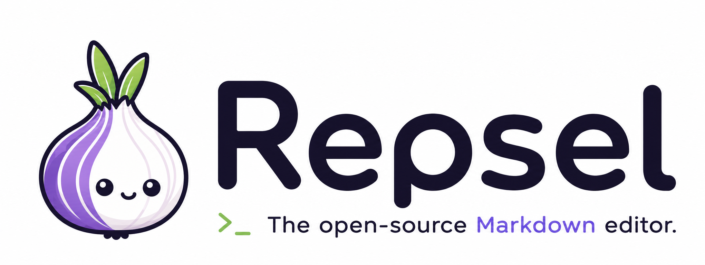

<div align="center">
  <p></p>

  # Repsel

  **Un éditeur Markdown de bureau, sobre et concentré, conçu pour Linux.**

  Écriture fluide, formules mathématiques et export PDF dans une application
  locale fondée sur Tauri et WebKitGTK.
</div>

## Télécharger Repsel 1.0.0

Repsel est disponible pour Linux sur les machines 64 bits.

| Format | Usage | Téléchargement |
| --- | --- | --- |
| Debian `.deb` | Debian, Ubuntu et distributions dérivées | [Repsel 1.0.0 AMD64](https://github.com/evdk25-wq/Repsel/releases/download/v1.0.0/Repsel_1.0.0_amd64.deb) |
| AppImage | Exécution portable sans installation | [Repsel 1.0.0 AMD64](https://github.com/evdk25-wq/Repsel/releases/download/v1.0.0/Repsel_1.0.0_amd64.AppImage) |

Toutes les versions et leurs notes sont disponibles dans les
[releases GitHub](https://github.com/evdk25-wq/Repsel/releases).

### Installer le paquet Debian

```bash
sudo apt install ./Repsel_1.0.0_amd64.deb
```

### Lancer l’AppImage

```bash
chmod +x Repsel_1.0.0_amd64.AppImage
./Repsel_1.0.0_amd64.AppImage
```

## À propos

Repsel est un éditeur Markdown pensé pour écrire sans détourner l’attention du
document. Son interface s’intègre naturellement à un environnement Linux et
combine la simplicité d’un fichier texte avec un rendu visuel immédiat.

Les documents restent des fichiers Markdown standards. Repsel ne demande aucun
compte et ne dépend d’aucun service en ligne pour ouvrir, modifier ou
enregistrer un document.

## Fonctionnalités

- édition Markdown avec CodeMirror 6 ;
- masquage visuel de la syntaxe hors de la ligne active ;
- titres, listes, citations, tâches, tableaux, liens et blocs de code ;
- formules mathématiques en ligne et centrées ;
- palette d’insertion et commandes rapides ;
- barre d’outils contextuelle ;
- ouverture, enregistrement et « Enregistrer sous » ;
- protection des modifications non enregistrées ;
- export PDF A4 avec pagination et rendu mathématique adapté à WebKitGTK ;
- thèmes clair et sombre persistants ;
- interface disponible en français et en anglais ;
- compteurs de mots et de caractères ;
- interface sans décoration native, adaptée au bureau Linux.

## Syntaxe mathématique

Repsel utilise la syntaxe TeX habituelle :

```markdown
Une formule en ligne : $E = mc^2$

Une formule centrée :

$$
f(x) = \frac{1}{\sigma\sqrt{2\pi}}
\exp\left(-\frac{(x-\mu)^2}{2\sigma^2}\right)
$$
```

KaTeX assure l’affichage dans l’éditeur. Pour l’export PDF, MathJax 4 produit
des SVG intermédiaires afin d’éviter les déformations de fractions, de racines
et de matrices rencontrées avec la capture HTML classique sous WebKitGTK.

## Raccourcis

| Action | Raccourci |
| --- | --- |
| Nouveau document | `Ctrl+N` |
| Ouvrir | `Ctrl+O` |
| Enregistrer | `Ctrl+S` |
| Enregistrer sous | `Ctrl+Maj+S` |
| Gras | `Ctrl+B` |
| Italique | `Ctrl+I` |
| Insérer un lien | `Ctrl+K` |
| Palette d’insertion | `Ctrl+P` |
| Aide Markdown | `Ctrl+/` |

## Pourquoi Tauri et WebKitGTK ?

Repsel utilise Tauri 2 plutôt qu’un navigateur Chromium embarqué. Sous Linux,
l’interface repose sur WebKitGTK, ce qui permet de conserver une application
plus compacte, une consommation de ressources maîtrisée et une meilleure
intégration au système.

## Installation pour le développement

### Prérequis

- Node.js 20 ou supérieur ;
- npm ;
- Rust stable ;
- les dépendances système requises par Tauri 2.

Sur Debian ou Ubuntu :

```bash
sudo apt update
sudo apt install \
  build-essential \
  curl \
  file \
  libappindicator3-dev \
  libgtk-3-dev \
  librsvg2-dev \
  libssl-dev \
  libwebkit2gtk-4.1-dev \
  patchelf
```

Installez ensuite Rust si nécessaire :

```bash
curl --proto '=https' --tlsv1.2 -sSf https://sh.rustup.rs | sh
```

### Lancer Repsel

```bash
cd chemin/vers/Repsel
npm install
npm run tauri dev
```

Le serveur Vite utilise le port `1420` pendant le développement.

## Construire l’application

```bash
npm run tauri build
```

Les paquets générés sont placés dans :

```text
src-tauri/target/release/bundle/
```

## Vérifications

```bash
npm test
npm run build
cd src-tauri
cargo test
```

La suite couvre notamment le domaine documentaire, l’analyse Markdown,
l’interface principale et le rendu SVG des formules mathématiques.

## Architecture

Le code sépare les règles métier, les cas d’usage, les accès au système et
l’interface :

```text
src/
├── domain/                 Modèle documentaire et analyse Markdown
├── application/
│   └── pdf/                Génération et rendu mathématique du PDF
├── infrastructure/
│   └── tauri/              Dialogues et accès aux fichiers
└── ui/
    ├── components/         Composants React
    ├── editor/             Extension CodeMirror
    └── styles/             Thèmes et mise en page

src-tauri/                  Application native Rust et configuration Tauri
```

Cette organisation s’inspire de la Clean Architecture : le domaine ne dépend
pas de React ou de Tauri, tandis que les détails du système sont isolés dans
l’infrastructure.

## Technologies

- React 19 et TypeScript ;
- CodeMirror 6 et Lezer Markdown ;
- Tailwind CSS 4 ;
- KaTeX et MathJax 4 ;
- Tauri 2 et Rust ;
- WebKitGTK sous Linux ;
- Vitest et Testing Library.

## Documentation

Le manuel d’utilisation est disponible dans
[`DOCUMENTATION.md`](DOCUMENTATION.md).

## Contribuer

Les rapports de bugs et propositions d’amélioration peuvent être ouverts dans
les issues du dépôt. Pour proposer une modification :

1. créez une branche dédiée ;
2. ajoutez ou adaptez les tests concernés ;
3. exécutez les vérifications du projet ;
4. ouvrez une pull request avec une description concise du changement.

## Licence

Repsel est distribué sous licence MIT. Consultez le fichier
[`LICENSE`](LICENSE) pour les conditions complètes.
